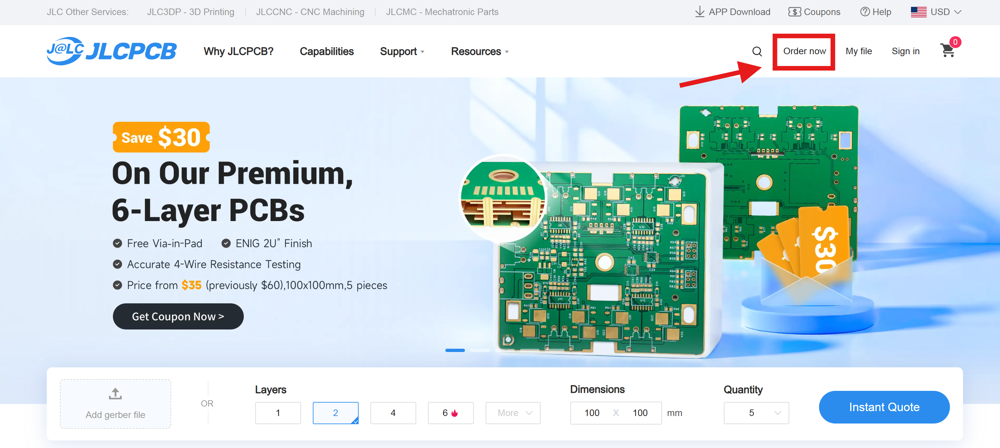
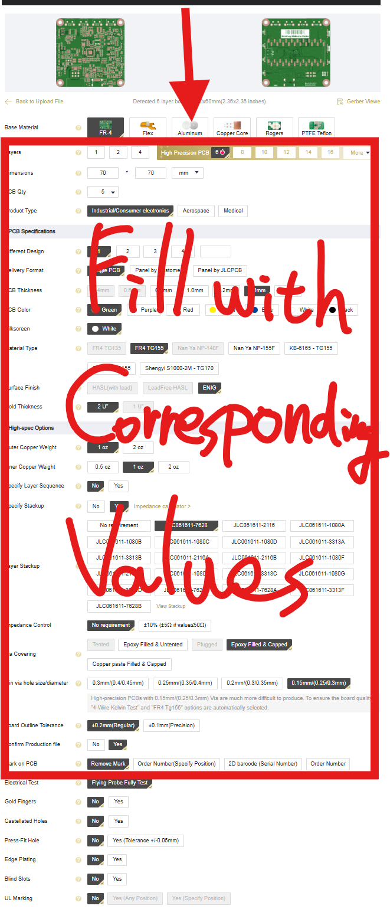
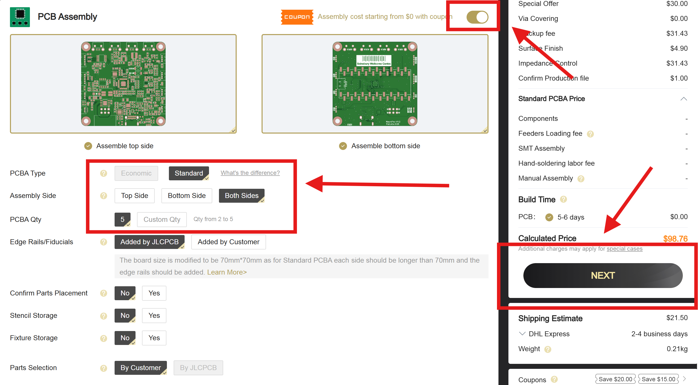
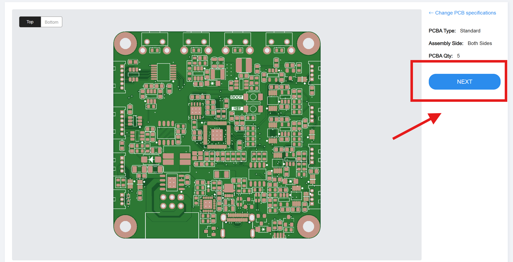
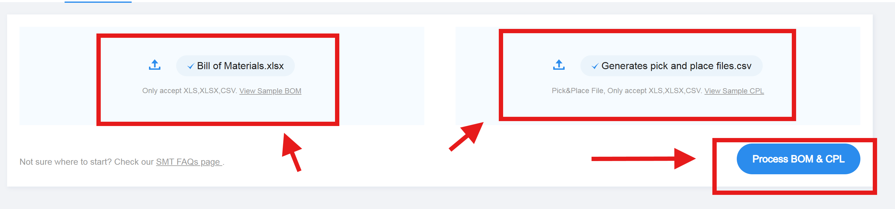
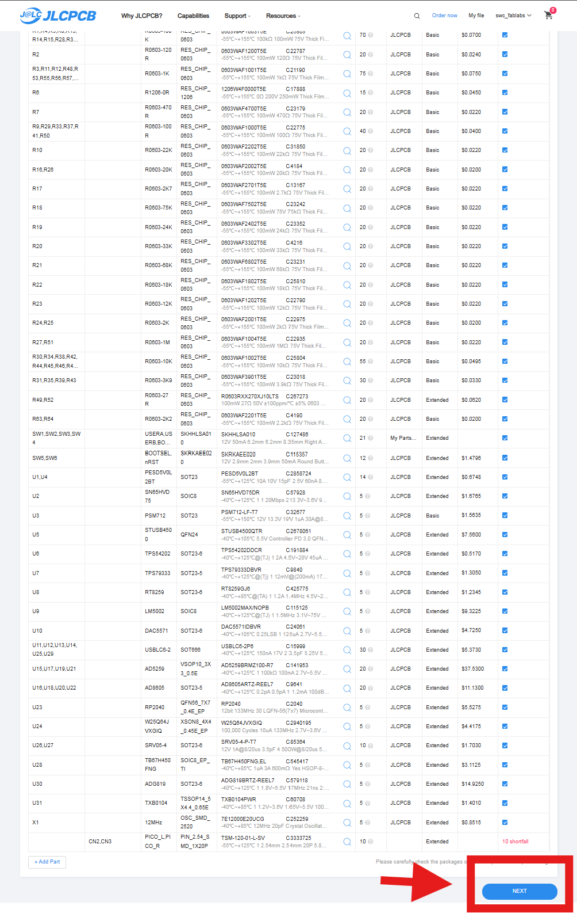
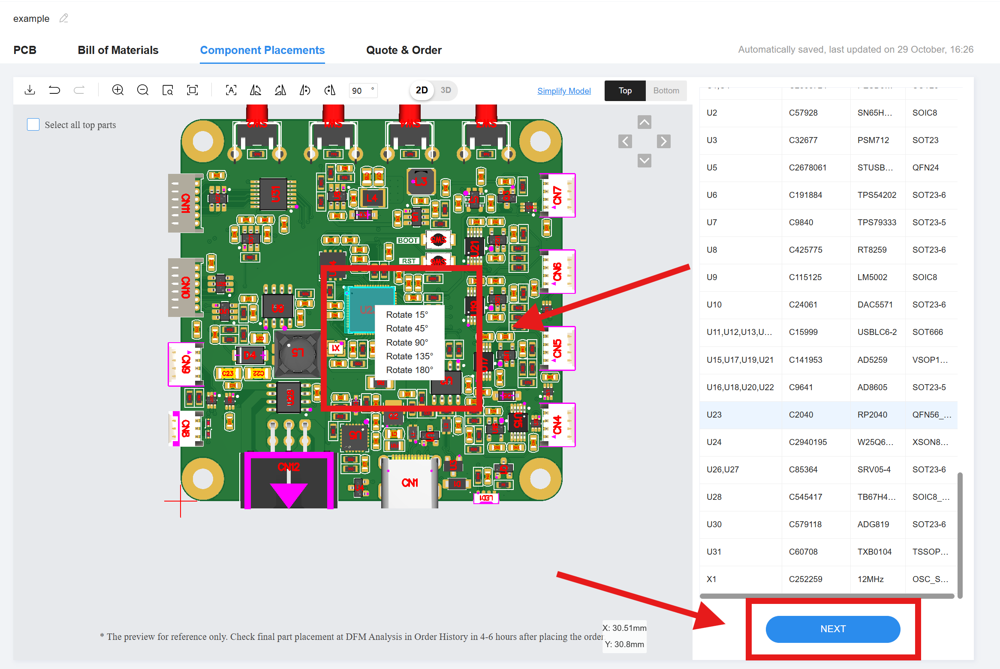

# Instructions for JLCPCB Orders

The following instructions will guide you through the process of placing an order for PCB fabrication and assembly with JLCPCB with the files provided by FabLabs.

## 1. Prepare the fabrication files

Zip gerber and NC drill folder attached in the target release. Recommend naming the zip file to be meaningful if you are expecting to place reorder in the future.

```bash
├── PCB.zip
│   ├── Fabrication/
│   │   ├── Gerber/         # <--Zip these folders-->
│   │   └── NC Drill/       # <--to a single zip file-->

```

## 2. Place the PCB order

Navigate to ([JLCPCB website](https://jlcpcb.com/)) and upload the zip file.

<p float="left", align="center">
   
   
</p>

Fill in the order details with the table provided in the target release.

<p  align="center">

</p>

## 3. PCB with assembly order

If you are placing an order with assembly, you will be asked to upload the BOM and pick-and-place files attached in the target release.

```bash
├── PCB.zip
│   ├── Assembly/
│   │   ├── BOM.xlsx         # Bill of Materials
│   │   └── pick and place.csv # Pick and Place File

```





## 4. Component selection

All the BOM list FabLabs provides include JLCPCB part numbers for easy reference.

The website will automatically match the components in your BOM with the available components in JLCPCB inventory based on the part numbers provided.

**Note:** Not all the components are available at JLCPCB all the time. It is recommended to check the component availability before placing the order. You can use the "Parts Library" feature on JLCPCB website to check the availability of components by JLCPCB part numbers. Order low availability components in advance to avoid delays in your PCB assembly.



## 5. Assembly review and confirmation

Before finalizing your order, review the assembly details carefully. Make sure all components are correctly placed and oriented. Right click on the part to change orientation if needed.


